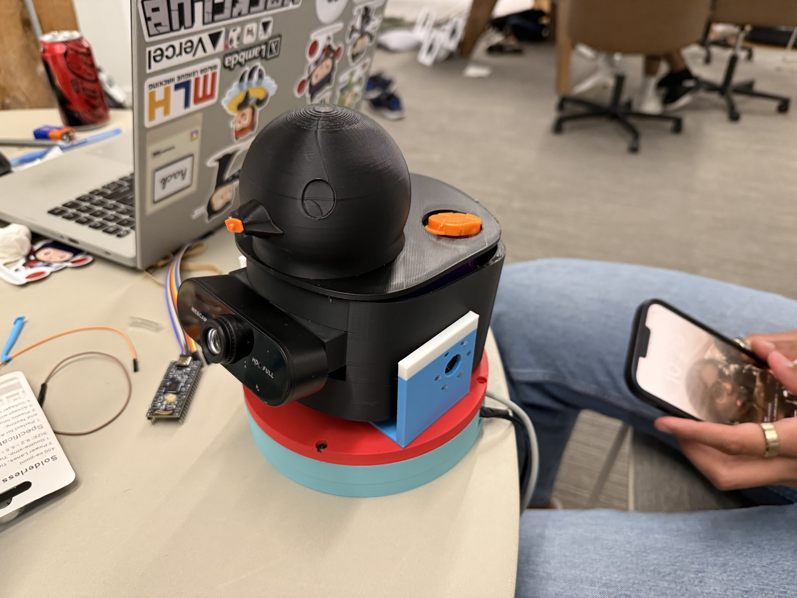
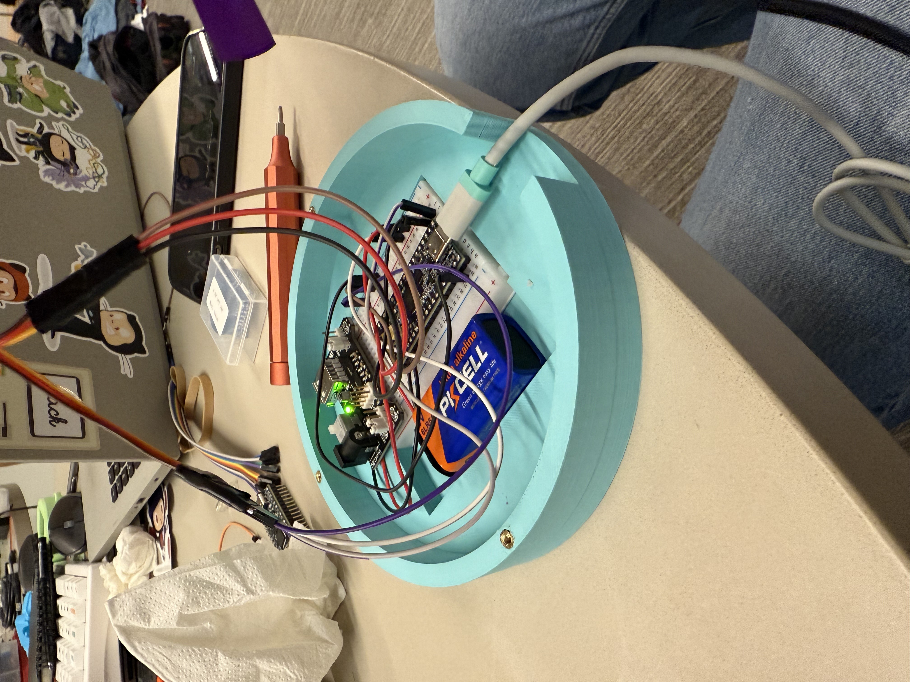
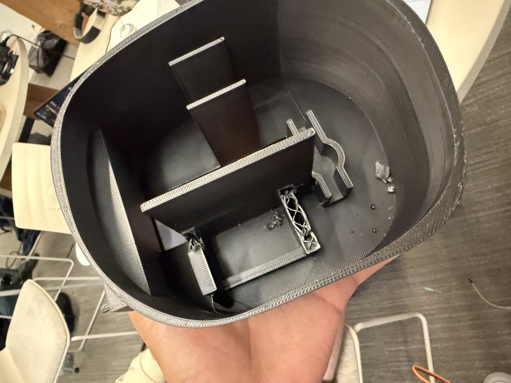
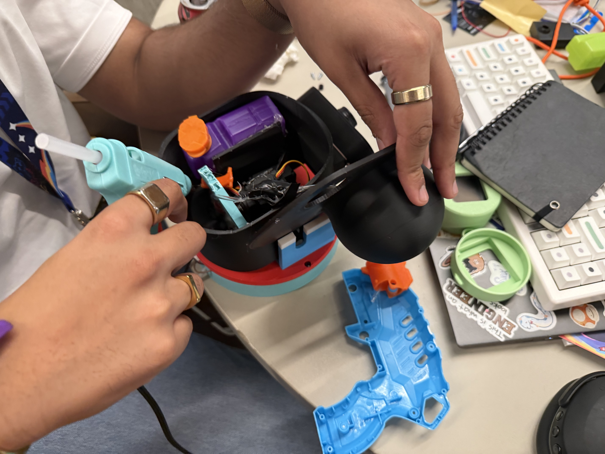
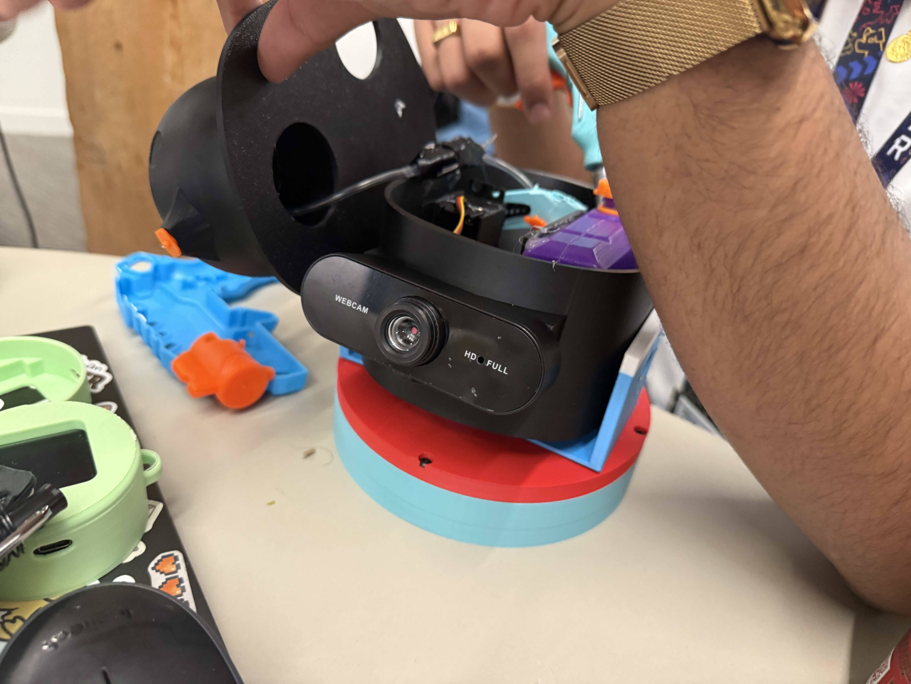

# Duck Off Doomscrolling



https://www.youtube.com/watch?v=_19QPQVmDLk

## Project Overview

This project was made as a part of [Highway Undercity](https://highway.hackclub.com), a 4 day in person Hackathon hosted by [Hack Club](https://hackclub.com) and Github. 

Duck off Doomscrolling (or D.O.B for short) is a fun way to quit destructive/disruptive/depressing social media! Basically it is a duck that will sit on your desk while you work and squirt water on you if you open doom scrolling apps such as Instagram Reels, Youtube shorts, X, or whatever you want. 
**
LETS QUIT DOOMSCROLLING :D**

## Technical Details

The base of the design is a cheap water gun powered by a servo motor, servo motors to pivot the duck towards the user, allowing for accuracy even in situations where the user is moving. The position of the user is attained using an hd webcam running OpenCV for facetracking. The base of doomscrolling detection is Apple Shortcuts, which ping a webserver whenever a non-desired app is opened.

## BOM

| Quantity | Name                    | Description                                                       | Source                                                                        |
|----------|-------------------------|-------------------------------------------------------------------|-------------------------------------------------------------------------------|
| 3        | MG 996R Servo Motor     | Used for trigger, pitch and yaw control                           |                                                                               |
| 1        | Orpheus Pico            | Used for servo control, Hack Club version of Raspberry Pi Pico    |                                                                               |
| 1        | Water Pistol            | Used for shooting water, disassembled to basic components         | https://www.target.com/p/tidal-storm-hydro-storm-5pk/-/A-91989016#lnk=sametab |
| 1        | Breadboard              | Used for Circuit connections, could use perfboard instead         |                                                                               |
| 1        | Breadboard Power Supply | Powers 5V to servos from the 9V battery, any Buck Converter works |                                                                               |
| 1        | 9V battery              | Powers the servos                                                 |                                                                               |
| ~10      | Jumper Cables           | Circuit connections                                               |                                                                               |
| 1        | HD Webcam               | Used for face tracking                                            |                                                                               |
| 6        | 3D Printed Parts        | Packaging/Mounting                                                |                                                                               |
| 10       | Hot Glue Sticks         | Mounting and sealing                                              |                                                                               |
| Idk      | M3 screws               | For servo mounting and other                                      |                                                                               |
| Idk      | M3 Heatset Inserts      | Fort servo mounting and other                                     |                                                                               |

## Electrical Components

There are three servos, a breaboard, breadboard power supply, 9V battery, and an orpheus pico :D



## Duck Internals





## Code Details

First the camera captures video, which the computer processes to draw a box around a face via OPENCV. Then the computer tells the pico over serial what angle the servos should be at to center the midpoint of the box at the center of the screen/webcam feed. Through that info, the pico will then directly command the servos to move. The duck knows when to shoot via a web server, which can receive web hooks that the phone triggers over local wifi networks. When it is told to shoot it triggers a servo to push down on the pump to shoot the water >:D

## Code Changes Needed if you try this yourself!

The video capture feed may need to be changed, depending on the order of webcams connected to the device

```python
capture = cv2.VideoCapture(1)
```

The COM port may need to be changed, depending on the COM port that the orpheus pico is on.

```python
pico = serial.Serial('COM8', 115200)
```

For the two shortcut iphone automations (sorry android users; you're going to have to find a different way...), you'll need to change the IP address of the web server that when you send the HTTP GET request to.\
[https://www.icloud.com/shortcuts32e442381f65458999b183d71369fe7c](https://www.icloud.com/shortcuts32e442381f65458999b183d71369fe7c)\
[https://www.icloud.com/shortcuts/f4db4c2699c545bbb66151e4c6e04d96](https://www.icloud.com/shortcuts/f4db4c2699c545bbb66151e4c6e04d96)

### QR Codes for Shortcuts


